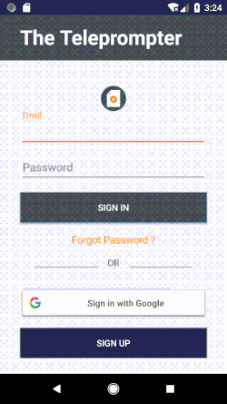
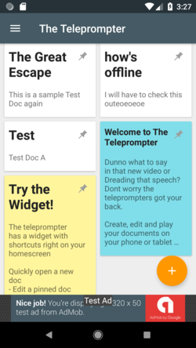
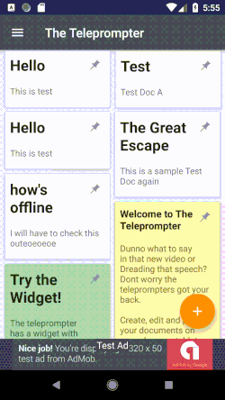
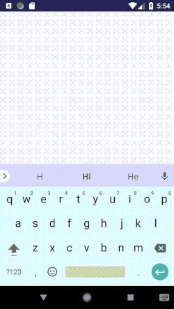
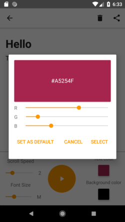
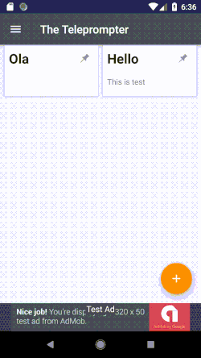
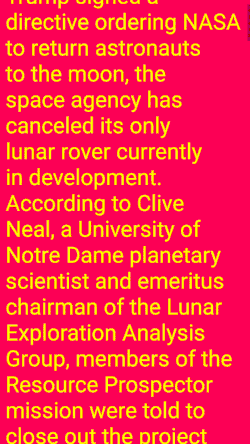
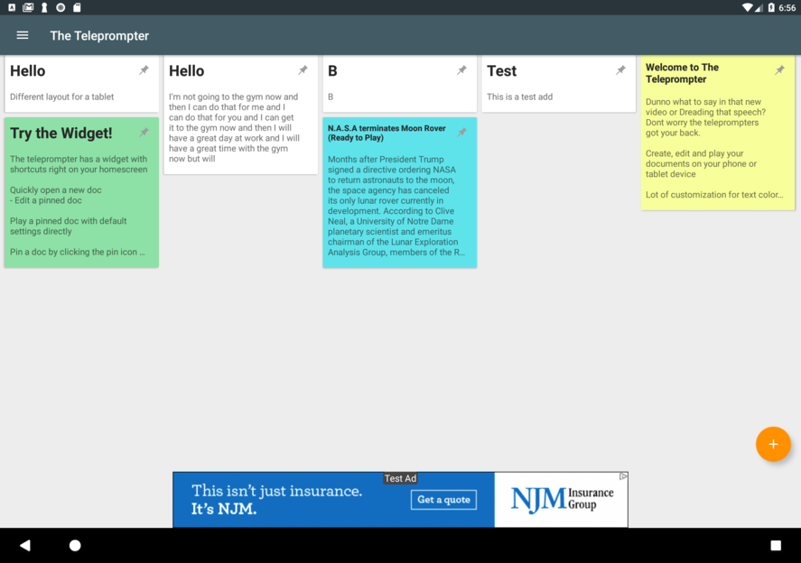
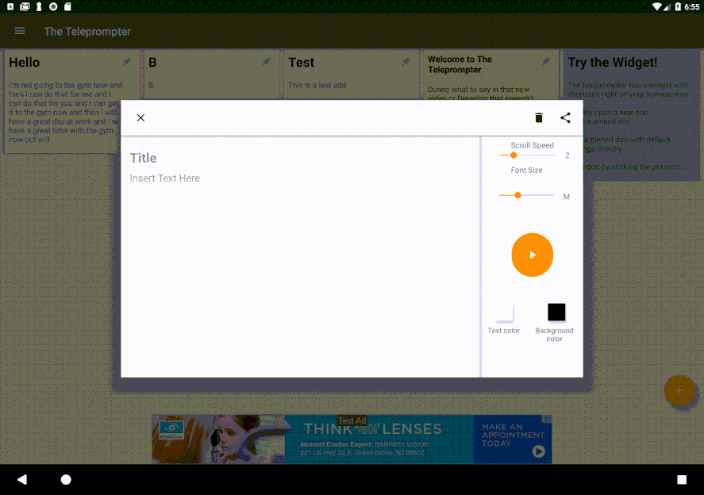

# The Teleprompter

* Planned and developed a teleprompter for Android devices, where users can create, edit, play and share documents. Documents are synced  locally through a Content Provider and on the cloud using the Firebase Realtime Database. 
* Created custom views for application specific functionality and Widget to provide essential shortcuts on the homescreen.
* The application authenticates users through an email or Google Sign in using Firebase Authentication and Firebase Email Verification.  Forgotten passwords can be retrieved using the email
* Performed UI tests using the Espresso testing framework and provided Ad Service using Google AdMobs
* Designed a responsive user interface for phones and tablets by following the Material Design guidelines

  

  

The application provides various customization options to create and edit documents.
It also provides customization for choosing the text color, background color, scroll speed and 
font size.

  

  

Seamlessly play documents with your selected customization options.

  

The application provides a flexible layout for different screen sizes. 
Optimized design for tablet devices.

  

# Download from Google Play

The application can be downloaded from Google Play using 
the following URL

https://play.google.com/store/apps/details?id=com.ctp.theteleprompter

